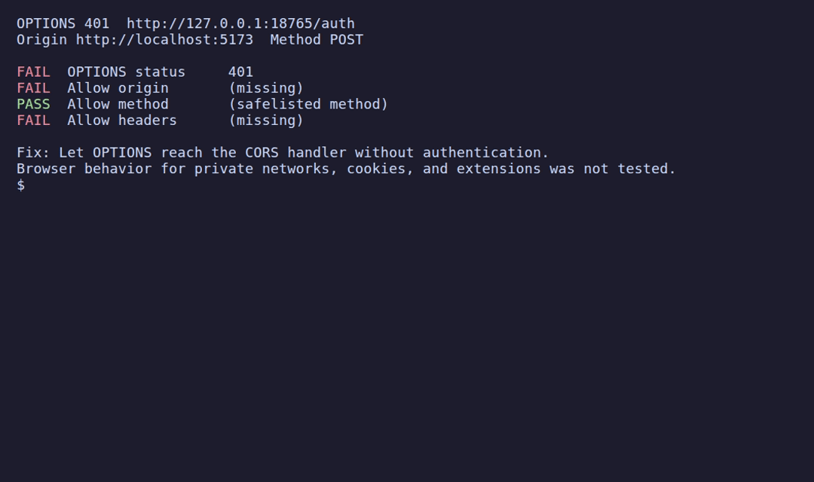

<h1 align="center">
  <br>
  corswhy
</h1>

<p align="center">
  <strong>Find which response header rejects a browser's CORS preflight before you change server code.</strong>
</p>

<p align="center">
  <a href="https://github.com/Arthur031221/corswhy/stargazers"></a>
  <a href="https://github.com/Arthur031221/corswhy/actions"></a>
  <a href="LICENSE"></a>
</p>

<p align="center">
  <a href="#quickstart">⚡ Quickstart</a> •
  <a href="#how-it-works">🔍 How it works</a> •
  <a href="#examples">📖 Examples</a> •
  <a href="#faq">💬 FAQ</a>
</p>

> [!TIP]
> With the included demo server running, inspect its 401 route without a global install. Requires Node.js 20 or newer:
> ```sh
> npx --yes github:Arthur031221/corswhy http://127.0.0.1:18765/auth --origin http://localhost:5173 --method POST --header authorization,content-type --credentials include
> ```

<p align="center">
  
</p>

## Why corswhy

Browsers send an `OPTIONS` preflight before some cross-origin requests. If authentication blocks `OPTIONS`, or a response does not allow the requested origin or headers, the browser reports a generic CORS error before the actual request reaches your handler.

A raw `OPTIONS` response shows headers but leaves you to compare them with the browser's origin, method, and requested headers. corswhy runs those checks and reports which one failed, with a repair hint, before you change server code.

## Features

- 🔎 **Checks the preflight response:** Reports the status, allowed origin, credentials when requested, method, and requested headers.
- 📨 **Sends browser preflight fields:** Includes `Origin`, `Access-Control-Request-Method`, and the header names supplied with `--header`.
- 🛑 **Sends only OPTIONS:** It never sends the actual request or a request body.
- ⚡ **Skips unnecessary probes:** A GET, HEAD, or POST without named unsafe headers needs no preflight, so corswhy sends nothing.
- 🧾 **Explains failed checks:** Shows each check and a repair hint for the first failure.
- 🗂 **Supports scripts:** Use `--json` for a structured report.

## Quickstart

Requires Node.js 20 or newer. From a checkout, install with `npm install -g .`. To run from GitHub without a global install, use `npx github:Arthur031221/corswhy` before the URL and options shown below.

With a local API at `http://localhost:8000/api` that returns 401 to OPTIONS, run:

```sh
corswhy http://localhost:8000/api \
  --origin http://localhost:5173 \
  --method POST \
  --header authorization,content-type \
  --credentials include
```

```text
OPTIONS 401  http://localhost:8000/api
Origin http://localhost:5173  Method POST

FAIL  OPTIONS status     401
FAIL  Allow origin       (missing)
FAIL  Allow credentials  (missing)
PASS  Allow method       (safelisted method)
FAIL  Allow headers      (missing)

Fix: Let OPTIONS reach the CORS handler without authentication.
Browser behavior for private networks, cookies, and extensions was not tested.
```

## Examples

Start the included fixture server in another terminal:

```sh
node demo/server.js
```

Its `/ok` route returns the required CORS response headers. A GET without named unsafe headers does not need a preflight, so corswhy sends no request.

<table>
  <tr>
    <td width="50%" valign="top">
      <b>Passing preflight</b>
      <pre><code>corswhy http://127.0.0.1:18765/ok \
  --origin http://localhost:5173 \
  --method POST \
  --header authorization,content-type

OPTIONS 204  http://127.0.0.1:18765/ok
Origin http://localhost:5173  Method POST

PASS  OPTIONS status     204
PASS  Allow origin       http://localhost:5173
PASS  Allow method       POST
PASS  Allow headers      authorization, content-type

Preflight checks passed. The actual response was not tested.
Browser behavior for private networks, cookies, and extensions was not tested.</code></pre>
    </td>
    <td width="50%" valign="top">
      <b>No preflight needed</b>
      <pre><code>corswhy http://127.0.0.1:18765/ok --origin http://localhost:5173

No preflight expected for these inputs. Supply header names from the browser preflight if it sent one.
Actual response CORS checks were not tested.</code></pre>
    </td>
  </tr>
</table>

## How it works

corswhy sends `OPTIONS` with `Origin`, `Access-Control-Request-Method`, and, when supplied, the names in `Access-Control-Request-Headers`. It checks the response status, allowed origin, credentials when requested, method, and headers. It does not send POST, PUT, DELETE, or a request body.

| Tool | What it does | Where corswhy differs |
| --- | --- | --- |
| `curl` with an OPTIONS request | Sends manually chosen headers and displays the raw response. | corswhy builds the browser preflight fields and evaluates the CORS response against the supplied inputs. |
| Browser DevTools | Shows requests and responses from an actual browser flow. | corswhy probes the supplied URL, origin, method, and header names, then summarizes the preflight checks. |

The checks follow the [Fetch standard's CORS protocol](https://fetch.spec.whatwg.org/#http-cors-protocol). The [MDN preflight guide](https://developer.mozilla.org/en-US/docs/Glossary/Preflight_request) explains why browsers send OPTIONS before certain cross-origin requests.

<details>
<summary><b>Options</b></summary>

| Option | Meaning |
| --- | --- |
| `--origin ORIGIN` | Required browser origin, such as `http://localhost:5173` |
| `--method METHOD` | Actual request method, default `GET` |
| `--header NAMES` | Names from `Access-Control-Request-Headers` |
| `--credentials MODE` | `omit`, `same-origin`, or `include`, default `omit` |
| `--timeout MS` | OPTIONS timeout, default 5000 |
| `--json` | Structured report for an issue or script |
| `--no-color` | Plain terminal output |

`--header` takes the names shown in a browser's `Access-Control-Request-Headers` request header. For a JSON POST, include `content-type`; for a bearer token, include `authorization`. Separate names with commas or repeat the option.

For a cross-origin request, `same-origin` behaves like `omit` for the CORS response checks. The preflight request itself never includes cookies. Use `include` if the browser's request uses `credentials: 'include'`.

</details>

## FAQ

<details>
<summary><b>Does corswhy send the actual request?</b></summary>

No. It sends an OPTIONS request only. It does not send POST, PUT, DELETE, or a request body.

</details>

<details>
<summary><b>Does a passing report guarantee that my application request will work?</b></summary>

No. The verdict covers the supplied OPTIONS exchange. It does not test the actual response, browser cookie policy, private network access, service workers, browser extensions, preflight caching, or differences caused by browser-generated headers. A passing report means the supplied preflight checks passed, not that the full application request will succeed.

</details>

<details>
<summary><b>When does corswhy send nothing?</b></summary>

A GET, HEAD, or POST without named unsafe headers does not need a preflight, so corswhy sends no request in that case.

</details>

<details>
<summary><b>How do credentials affect the check?</b></summary>

For a cross-origin request, `same-origin` behaves like `omit` for CORS response checks. The preflight request itself never includes cookies. Use `include` if the browser request uses `credentials: 'include'`.

</details>

<details>
<summary><b>Local demo and tests</b></summary>

Run `npm test` for the local HTTP fixtures. `bash demo/render.sh` records the GIF with VHS and stops its local server before exiting. The fixture server exposes `/auth`, which returns OPTIONS 401, and `/ok`, which returns the required CORS response headers.

</details>

## Contributing

See [CONTRIBUTING.md](CONTRIBUTING.md) for local development. To report an issue, [open an issue](https://github.com/Arthur031221/corswhy/issues).

## License

MIT licensed. See [LICENSE](LICENSE).
